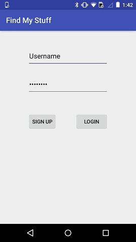
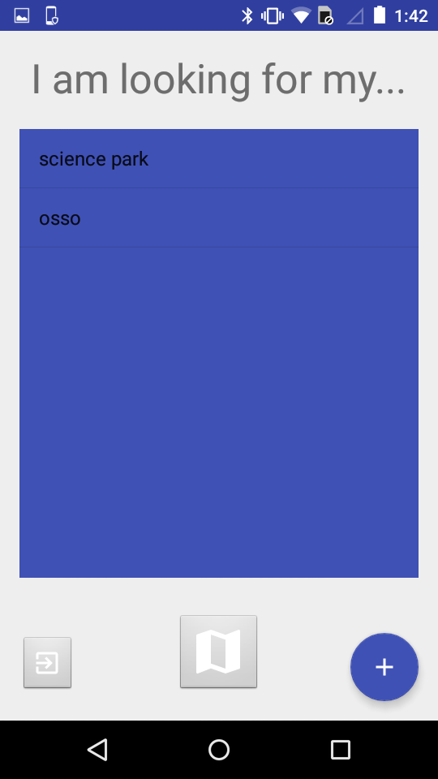
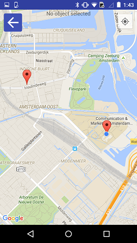
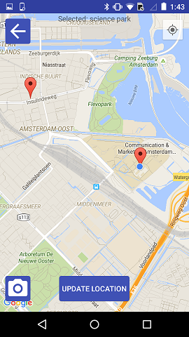
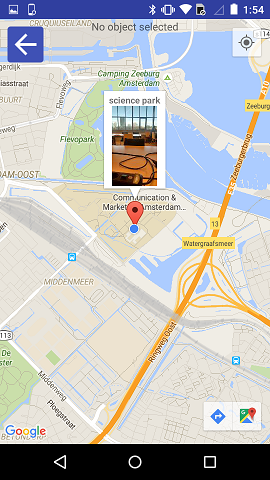
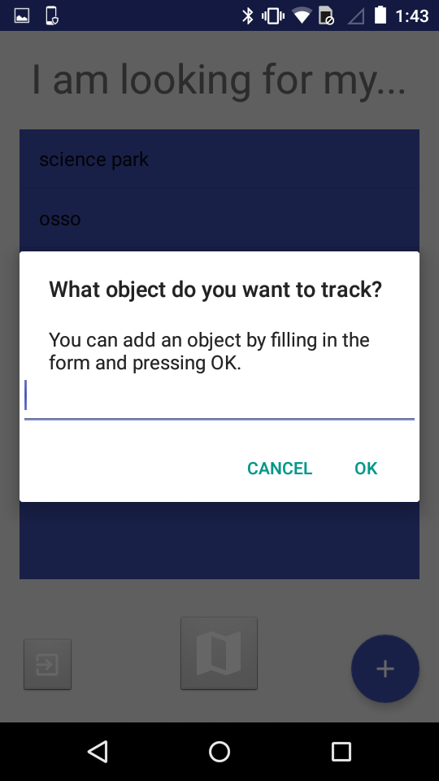

# Find My Stuff

De app Find My Stuff geeft de gebruiker de mogelijkheid om objecten toe te voegen aan een lijst. Wanneer een object is toegevoegd aan de lijst, kan de gebruiker de locatie opslaan van het object en een foto toevoegen aan het object. Vervolgens kan de gebruiker object selecteren die in de lijst staan om de locatie en de foto te kunnen zien op de kaart. Hiermee zal de gebruiker nooit meer objecten kwijtraken!

