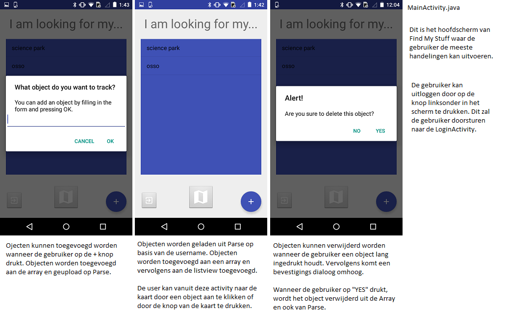
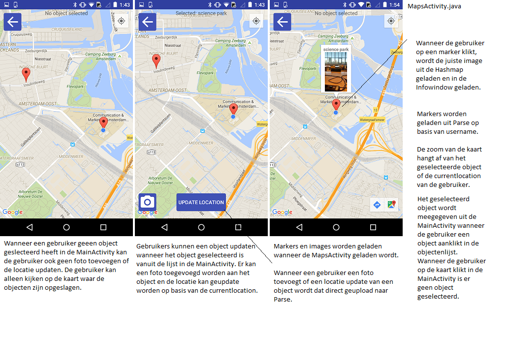

# Report
# Find My Stuff

Jochem van Dooren
10572929

###Beschrijving
De app Find My Stuff geeft de gebruiker de mogelijkheid om objecten toe te voegen aan een lijst. Wanneer een object is toegevoegd aan de lijst, kan de gebruiker de locatie opslaan van het object en een foto toevoegen aan het object. Vervolgens kan de gebruiker object selecteren die in de lijst staan om de locatie en de foto te kunnen zien op de kaart. Hiermee zal de gebruiker nooit meer objecten kwijtraken!

###Uitdagingen

Bij het ontwikkelen van Find My Stuff zijn er een aantal onverwachte problemen ontstaan. De problemen zijn ontstaan bij het toevoegen van beacons, infowindows en het gebruiken van Parse.

- Beacons

Find My stuff had beacons moeten gebruiken om de functionaliteit van de app te vergroten. De beacons zouden de app de mogelijkheid moeten geven om locaties van objecten te updaten op de achtergrond, zonder input van de gebruiker.De beacons maakten gebruik van de Estimote SDK. Om de uitdagingen te omschrijven worden er drie devices gedefiniëerd: Iphone 5S (iOS) = device1, Samsung Galaxy S3 (Android) = device2 en Motorola E (Android) = device3.

Het is gelukt om de beacons te connecten met device1 en device2 via de officiële Estimote app. Hierna is het gelukt om de beacons te laten connecten met device2 via de Find My Stuff app. Het was op een gegeven moment mogelijk voor de Find My Stuff app op device2 om te kunnen detecteren wanneer de beacons in of uit een bepaalde range (1,5m) waren. Een dag later was dit echter niet meer mogelijk. (zonder dat de Java file van de beacons veranderd was!) Device2 gaf problemen met de bluetooth die er voorheen niet waren. De bluetooth van het apparaat werd telkens in- en uitgeschakeld, wat het gebruik van bluetooth onmogelijk maakte. Ook de officiële Estimote app deed het niet meer op device2. Een belangrijk detail is dat de Estimote app het wél altijd heeft blijven doen op device1. Jaap heeft mij een leentelefoon (device3) gegeven om daarmee verder te gaan. Met device3 is hetzelfde gebeurd als device2, in de eerste instantie deed alles het naar behoren en op een gegeven kreeg ook deze device het bluetooth probleem wat device2 ook had. Het zag er naar uit dat het een probleem was met de Estimote SDK. 

- InfoWindow Google Maps

Omdat het toevoegen van de beacons onmogelijk bleek te zijn, is er een nieuwe feature toegevoegd aan Find My Stuff. De gebruiker kan de mogelijkheid hebben om foto's toe te voegen aan objecten. Omdat deze feature erg laat toegevoegd is, kan de gebruiker de foto's alleen maar zien op de kaart en niet in de listview. Het was te tijdsintensief om in het laatste stadium van de app nog de hele bestaande listview om te gooien. 

In de eerste instantie zou er een foto geladen moeten worden uit Parse wanneer er geklikt werd op een marker. Helaas is dit niet gelukt omdat Parse queries in de achtergrond doet. Hierdoor werd de infowindow gecreëerd voordat de foto geladen was uit Parse. De oplossing was om álle foto's van de gebruiker te laden wanneer de map geopend wordt. Dit is niet ideaal wanneer een gebruiker erg veel objecten heeft omdat dat erg veel tijd kan kosten.

- Parse

Parse voert alle queries asynchroon uit, hierdoor heb ik er voor gekozen om een handler te gebruiken om mijn listview te updaten. Hierdoor is er een kleine delay in het vullen van mijn listview. Dit is niet heel netjes maar het is niet iets waar de gebruiker zich aan zal storen. Hetzelfde geldt voor de markers: wanneer de map geopend wordt, moeten de markers eerst geladen worden voordat de map gecentreerd kan worden op de locatie van de marker. Hier is ook gebruik gemaakt van een handler om nullpointers te voorkomen.

Op een gegeven moment heeft Parse moeite gehad met het laden van de objectenlijst wanneer de lijst groter werd dan vijf objecten. Wanneer de lijst meer dan vijf objecten bevatte, laadde Parse helemaal niks meer. Dit probleem heeft zichzelf opgelost.

###Technisch design

